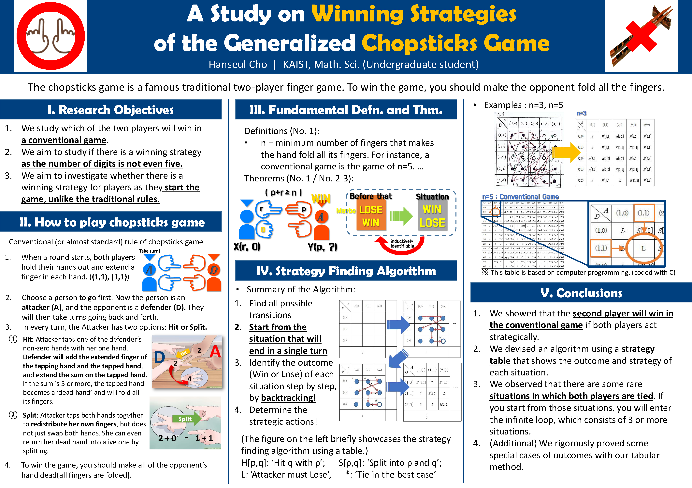

# Chopsticks_Game_strategy
Python code that can print a strategy table of a generalized (in terms of the number of fingers) chopsticks game.

Paper (Korean, but with an abstract in English): http://www.rne.or.kr/gnuboard5/teen_search/77?page=10 

```
python chopsticks.py [--n FINGER] [--game] [--txt]  # run the code to find a strategy table or play a game
```

## Poster



## Options

* `--n FINGER`: '`FINGER`' is the number(so, should be an integer) of 'fingers' in a hand(Default: **5**). In the chopsticks game, if a hand should spread all the fingers (it has) or more, the hand becomes 'dead'. 
* `--game`: If you want to play a game, use this option. If you do not use this option, then you can get a printed version of the strategy table.
* `--txt`: If you want to print the strategy table into a text file, use this option. This option only works when you do not use the `--game` option.

## Usage Examples

* To simply get a printed version (on terminal) of the strategy table for the usual/traditional game (with `FINGER==5`):
```
python chopsticks.py
```

* To get a printed version of the strategy table on a text file (called '20_fingers.txt') for `FINGER==20` (it takes ~2 min.):
```
python chopsticks.py --n 20 --txt
```

* To play a usual game for `FINGER==5` starting with (1,1), (1,1) (Computer v.s. You, starting with YOUR turn - you must lose.):
```
python chopsticks.py --game
```

* To play a game for `FINGER==4` starting with (1,1), (1,1) (Computer v.s. You, starting with YOUR turn - you can win.):
```
python chopsticks.py --n 4 --game
```

* To play a game for `FINGER==6` starting with (1,1), (1,1) (Computer v.s. You, starting with YOUR turn - you cannot win, but you will not lose only if you DO YOUR BEST):
```
python chopsticks.py --n 6 --game
```

## Observation (not rigorously proved)

If the chopsticks game starts with (1,1), (1,1), then the starting player (i.e., attacker at 1st round)...

1. ... can WIN (or, has a winning strategy), IF both players have 2 or 4 `FINGER`s.
2. ... must LOSE, IF its opponent is smart enough and both players have 5 `FINGER`s (as usual).
3. ... and its opponent cannot defeat each other (or, always TIE), IF both players are smart enough and have 3, or 6 OR MORE `FINGER`s.
